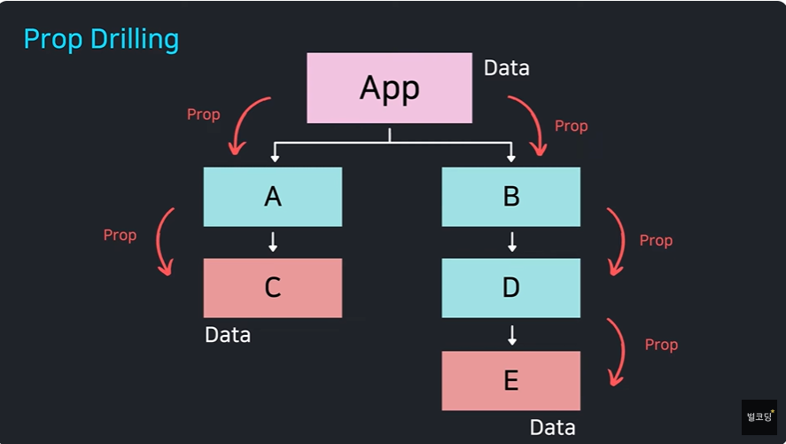
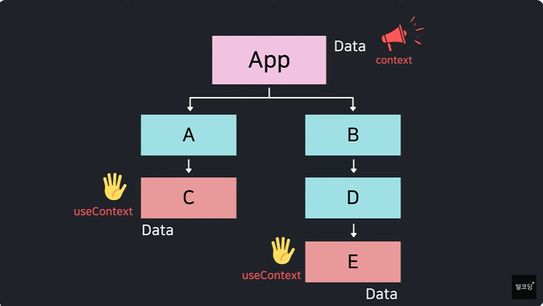

# 별코딩 useContext

## 컴포넌트 트리
* 일반적인 컴포넌트 트리
* 
---
* 컴포넌트 트리 잘못된 예
* 
---
* 컴포넌트 트리 잘못된 예2
* 
---
* 컴포넌트 트리 올바른 예
* 
* 컴포넌트 트리 올바른 예2
* 

###
react는 Context api 제공
데이터를 쉽게 공유하는 방법을 제공
상위컴포넌트가 하위컴포넌트에게 필요한 값을 제공할 수 있음
***

