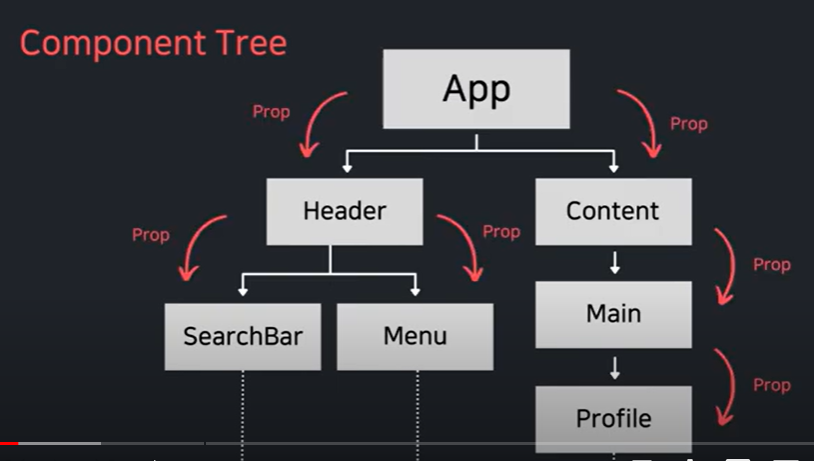

# 별코딩 useContext

## 컴포넌트 트리
* 일반적인 컴포넌트 트리
* 
---
* 컴포넌트 트리 잘못된 예
* 
---
* 컴포넌트 트리 잘못된 예2
* 
---
* 컴포넌트 트리 올바른 예
* 
* 컴포넌트 트리 올바른 예2
* 

###
react는 Context api 제공
데이터를 쉽게 공유하는 방법을 제공
상위컴포넌트가 하위컴포넌트에게 필요한 값을 제공할 수 있음
***

## Context
사용법
```js
import { createContext } from 'react';

export const ThemeContext = createContext(null);
```
별개의 context 를 하나 틀을 정의해주고

```js
<ThemeContext.Provider value={{isDark,toggleDarkness}}>
  <Page isDark={isDark} toggleDarkness={toggleDarkness}/>
</ThemeContext.Provider>
```
* 다음처럼 Context.Provide로 감싸준다.
* Context.Provide는 value에 넘겨주고싶은 값을 하나 넣으면된다.
* Context.Provide는 value prop는 하나의 값을 요구하는데
넘겨줘야하는 값이 2개이상이므로 {} 로 감싸 하나의 객체로 만들어준다.
* Context로 받아야하는 쪽에서는 useContext를 사용해서 값을 받는다.
```js
  import { useContext } from 'react';
  import { ThemeContext } from '../context/ThemeContext';
  //받는 쪽에서의 코드
  const data = useContext(ThemeContext);
  //또는
  const {isDark,toggleDarkness} = useContext(ThemeContext);
```


